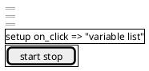
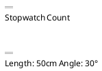
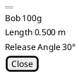
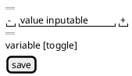
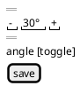

# Wireframe

## Persistent Page

```plantuml
@startsalt
{
  {==sticky topbar "experimental name"==}
  {==main==}
  {==sticky bottom==}
  {+ setup on_click => "variable list" }
  {+ [start stop] }
}
@endsalt
```

## Experiment Setup

```plantuml
@startsalt
{
  {== Values (center-x, top) ==}
  { Stopwatch | Count }
  .
  .
  {== Pendulum (center-x, center-y) ==}
  { Length: 50cm | Angle: 30° }
}
@endsalt
```

## Variable List Modal

```plantuml
@startsalt
{
  {== Variables ==}
  { Bob | 100g }
  { Length | 0.500 m }
  { Release Angle | 30° }
  { [Close] }
}
@endsalt
```

## Variable Modal (each)

```plantuml
@startsalt
{
  {==visual tool==}
  { "-" | "value inputable" | "+" }
  {==toggle constant/manipulated==}
  { variable [toggle] }
  { [save] }
}
@endsalt
```

## Angle Modal

```plantuml
@startsalt
{
  {== Upside-down protractor (pivoted on pendulum pivot) ==}
  { "-" | "30°" | "+" }
  {==toggle constant/manipulated==}
  { angle [toggle] }
  { [save] }
}
@endsalt
```